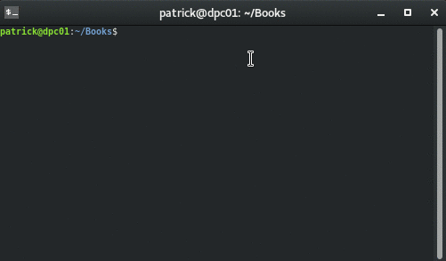

# kepubify
  

Convert your ePubs into kepubs, with an easy-to-use tool. Kepubify can also be embedded i to your own apps with the import path `github.com/geek1011/kepubify/kepub`.

## Usage
- On Windows, you can drag your book on top of `kepubify.exe`
- `kepubify /path/to/my/book.epub` will output to `./book.kepub.epub`
- `kepubify /path/to/my/book.epub /path/to/another/folder/` will output to `/path/to/another/folder/book.kepub.epub`
- `kepubify /path/to/my/book.epub /path/to/another/folder/newname.kepub.epub` will output to `/path/to/another/folder/newname.kepub.epub`

## Features
- Conversion
    - Adds kobo spans to allow notes and highlighting
    - Adds kobo divs
    - Smartens punctuation
    - Cleans up html
        - Removes extra characters
        - Removes MS Word tags
        - Removes ADEPT encryption leftover tags
    - Kobo style fixes
    - Clean up extra files from ePub
    - Remove extra calibre tags from content opf
- Coming soon:
    - Output
        - Automatically find kobo and import book
    - Integration with BookBrowser: download your ePubs as a kepub right from the Kobo Web Browser
    - Update Kobo series metadata

## Why would I use kepubify rather than calibre-kobo-driver
- Works from the command line
- Faster processing
- Standalone
- Does not add extra calibre meta tags

## Screenshots
|  |  |
| --- | --- |
|     |     |